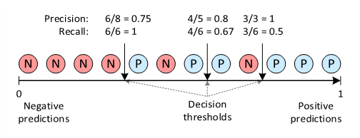
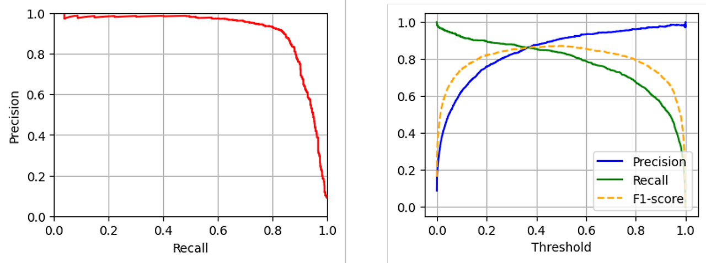
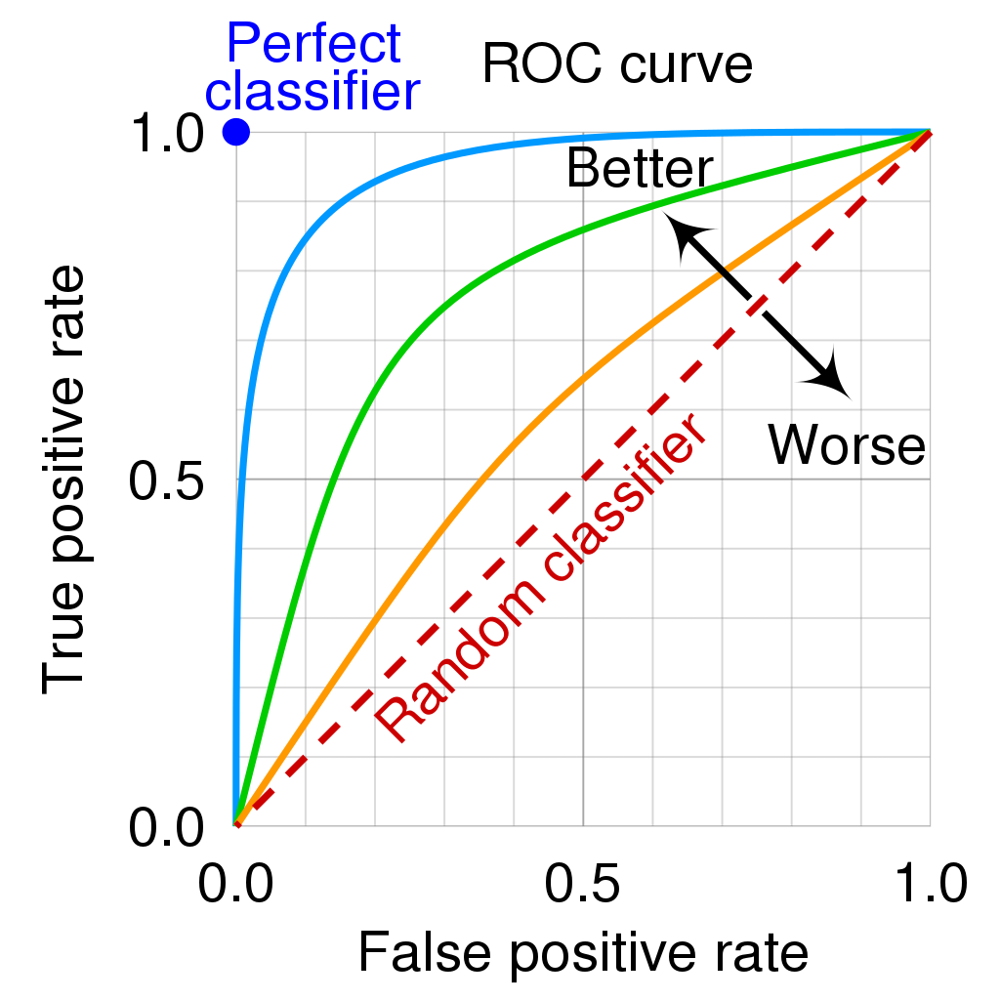

# 혼동 행렬(Confusion Matrix)

## 목차

- [Confusion Matrix란?](#confusion-matrix란)
- [Accuracy](#Accuracy)
- [Precision](#Precision)
- [Recall](#Recall)
- [F1-score](#f1-score)
- [Precision-Recall Curve](#precision-recall-curve)
- [AP (Average Precision)](#ap-average-precision)
- [ROC Curve](#roc-curve)
- [QA](#QA)

---

### Confusion Matrix란
참과 거짓 중 하나를 예측하는 문제였다고 가정해보자. 아래의 혼동 행렬에서 각 열은 예측값을 나타내며, 각 행은 실제값을 나타낸다.

|       | 예측 참 | 예측 거짓 |
| ----- | ---- | ----- |
| 실제 참  | TP   | FN    |
| 실제 거짓 | FP   | TN    |

다음과 같은 네가지 케이스에 대해 각각 TP, FP, FN, TN을 정의한다.
- TP(True Positive) : 실제 True인 정답을 True라고 예측(정답)
- FP(False Positive) : 실제 False인 정답을 True라고 예측(오답)
- FN(False Negative) : 실제 True인 정답을 False라고 예측(오답)
- TN(True Negative) : 실제 False인 정답을 False라고 예측(정답)

---

### Accuracy
Accuracy(정확도)란 판별한 전체 샘플 중 TP와 TN의 비율이다. 분류 모델을 평가하기에 가장 단순한 지표이지만, 불균형한 클래스를 가진 데이터셋을 평가하기 어렵다는 단점이 있다.
예를 들어, Positive와 Negative의 비율이 2:8로 불균형한 클래스를 가지는 데이터셋에서는 모든 예측을 Negative로 해버리는 엉터리 분류기의 정확도도 80%로 측정된다.

Accuracy = (TP + TN)/(TP + FP + FN + TN)

---

### Precision
Precision(정밀도)란 분류 모델이 Positive로 판정한 것 중, 실제로 Positive인 샘플의 비율이다. Precision은 Positive로 검출된 결과가 얼마나 정확한지를 나타낸다.

Precision = TP/(TP + FP)

---

### Recall
Recall(재현율)이란 실제 Positive 샘플 중 분류 모델이 Positive로 판정한 비율이다. Recall은 분류 모델이 실제 Positive 클래스를 얼마나 빠지지 않고 잘 잡아내는지를 나타낸다.

Recall = TP/(TP + FN)

---

### F1-score
분류 모델의 Precision과 Recall 성능을 동시에 고려하기 위해 F1-score라는 지표를 사용할 수 있다. 
F1-score는 Precision과 Recall의 조화평균으로 정의된다.
F1-score는 0과 1사이의 값이며 1에 가까울수록 분류 성능이 좋음을 나타낸다.

F1-score = 2 * (Precision * Recall)/(Precision + Recall)

---

### Precision-Recall Curve
Precision과 Recall은 trade-off관계에 있어 Precision이 올라가면 Recall이 떨어지고, Recall이 올라가면 Precision이 떨어진다.
분류 모델의 decision threshold를 통해 trade-off 관계를 조절 가능.
Decision threshold란 분류 모델의 결과인 [0, 1]사이의 값을 positive 또는 negative로 결정하는 경계를 의미한다

Precision과 Recall의 trade-off 관계는 왼쪽 그래프와 같이 Precision-recall curve를 통해 볼 수 있다.
또한 오른쪽의 그래프와 같이 Precision과 Recall값을 threshold 변화에 따른 그래프로 나타낼 수도있다.

---

### AP (Average Precision)
Precision-recall curve는 분류 모델의 전반적인 성능을 파악하기는 쉬우나, 다른 두 분류 모델간의 정량적 성능 비교가 어렵다.
따라서 Precision-recall curve에서 그래프 아래쪽 면적을 AP (Average Precision)으로 정의한다. 일반적으로 AP를 쉽게 계산하기 위해, Precision-recall curve를 interpolation하여 단조 감소하는 형태로 변환 후에 면적을 계산한다.
Multi-class 분류 모델에서는 각 클래스의 AP를 평균한 mAP(mean Average Precision)을 정의할 수 있으며, 컴퓨터 비전 분야의 object  detection 알고리즘 평가에 많이 사용된다.

---

### ROC Curve
ROC curve는 Threshold에 따른 TPR(=Recall)과 FPR(=Fall-out)을 나타낸 그래프다. 대각선을 기준으로 좌상단으로 붙어있는 ROC curve일수록 좋은 분류 성능을 나타낸다.

Precision-recall curve와 마찬가지로 ROC curve의 면적을 계산한 ROC-AUC (Area Under the Curve)를 통해 ROC curve를 정량적으로 나타낼 수 있다.

---

### 차이점
ROC curve는 데이터셋을 고려하지 않는 일반적인 상황에서의 분류 모델 성능을 확인할 대 사용할 수 있다. 반면 Precision-recall curve는 클래스 불균형이 심한 데이터셋을 통해 분류 모델 성능을 분석할 때 사용할 수 있다.

---

### QA

#### Q. 혼동 행렬에서 True Positive(TP)의 정의는 무엇인가요?
1. 실제 True인 정답을 True라고 예측
2. 실제 False인 정답을 True라고 예측
3. 실제 True인 정답을 False라고 예측
4. 실제 False인 정답을 False라고 예측

정답

1

#### Q. 혼동 행렬에서 False Positive(FP)의 정의는 무엇인가?
1. 실제 True인 정답을 True라고 예측
2. 실제 False인 정답을 True라고 예측
3. 실제 True인 정답을 False라고 예측
4. 실제 False인 정답을 False라고 예측

정답

2

#### Q. 혼동행렬에서 False Negative(FN)의 정의는 무엇인가?
1. 실제 True인 정답을 True라고 예측
2. 실제 False인 정답을 True라고 예측
3. 실제 True인 정답을 False라고 예측
4. 실제 False인 정답을 False라고 예측

정답

3

#### Q. 혼동 행렬에서 True Negative(TN)의 정의는 무엇인가?
1. 실제 True인 정답을 True라고 예측
2. 실제 False인 정답을 True라고 예측
3. 실제 True인 정답을 False라고 예측
4. 실제 False인 정답을 False라고 예측

정답

4

#### Q. Accuracy(정확도)는 무엇을 나타내는 지표인가요?
1. 판별한 전체 샘플 중 FP와 FN의 비율
2. 판별한 전체 샘플 중 TP와 TN의 비율
3. 판별한 전체 샘플 중 TP와 FP의 비율
4. 판별한 전체 샘플 중 FN과 TN의 비율

정답

2

#### Q. Accuracy를 구하는 공식은 무엇인가?
1. (TP + FP)/(TP + FP + FN + TN)
2. (TP + FN)/(TP + FP + FN + TN)
3. (TP + TN)/(TP + FP + FN + TN)
4. (FP + TN)/(TP + FP + FN + TN)

정답

3

#### Q. Accuracy는 어떤 경우 분류 모델을 평가하기에 어렵나?
1. 클래스가 균형 잡힌 데이터 셋
2. 클래스가 불균형한 데이터 셋
3. 클래스가 적은 데이터 셋
4. 클래스가 많은 데이터 셋

정답

2

#### Q. Accuracy의 단점은 무엇인가?
1. 판별한 전체 샘플 중 TP와 TN의 비율을 계산하기 어려움
2. 분류 모델을 평가하기에 가장 단순한 지표임
3. 불균형한 클래스를 가진 데이터 셋을 평가하기 어려움
4. 분류 모델을 평가하기에 가장 복잡한 지표

정답

3

#### Q. Accuracy는 어떤 경우 가장 단순한 지표가 되나?
1. 불균형한 클래스가 있는 경우
2. 클래스가 적은 데이터 셋
3. 클래스가 많은 데이터 셋
4. 클래스가 균형 잡힌 경우

정답

4

#### Q. Accuracy를 구할 때 필요한 값이 아닌 것은 무엇인가?
1. TP
2. TN
3. FP
4. PPV

정답

4

#### Precision(정밀도)은 무엇을 나타내는 지표인가?
1. 분류 모델이 Positive로 판정한 것 중, 실제로 Positive인 샘플의 비율
2. 분류 모델이 Negative로 판정한 것 중, 실제로 Negative인 샘플의 비율
3. 전체 샘플 중 TP의 비율
4. 전체 샘플 중 FP의 비율

정답

1

#### Precision을 구하는 공식은 무엇인가?
1. TP/(TP + FN)
2. TP/(TP + FP)
3. (TP + TN)/(TP + FP + FN + TN)
4. TN/(TN + FP)

정답

2

#### Precision이 높은 경우는 어떤 경우인가요?
1. 분류 모델이 Positive로 판정한 것 중 대부분이 실제로 Negative인 경우
2. 분류 모델이 Negative로 판정한 것 중 대부분이 실제로 Positive인 경우
3. 분류 모델이 Positive로 판정한 것 중 대부분이 실제로 Positive인 경우
4. 분류 모델이 Negative로 판정한 것 중 대부분이 실제로 Negative인 경우

정답

3

#### Recall(재현율)은 무엇을 나타내는 지표인가?
1. 실제 Positive 샘플 중 분류 모델이 Positive로 판정한 비율
2. 실제 Negative 샘플 중 분류 모델이 Negative로 판정한 비율
3. 분류 모델이 Positive로 판정한 것 중 실제로 Positive인 샘플의 비율
4. 전체 샘플 중 TP의 비율

정답

1

#### Recall을 구하는 공식은 무엇인가?
1. TP/(TP + FP)
2. TP/(TP + FN)
3. (TP + TN)/(TP + FP + FN + TN)
4. TN/(TN + FP)

정답

2

#### Recall이 높은 경우는 어떤 경우인가?
1. FP의 수가 적은 경우
2. TP의 수가 많은 경우
3. FN의 수가 적은 경우
4. FN의 수가 많은 경우

정답

3

#### Recall이 중요한 경우는 어떤 경우인가?
1. FP를 최소화하는 것이 중요한 경우
2. FN를 최소화하는 것이 중요한 경우
3. 전체 예측 정확도를 높이는 것이 중요한 경우
4. 모델의 학습 속도가 중요한 경우

정답

2

#### Recall을 구할 때 필요한 값들이 아닌 것은 무엇인가?
1. TP
2. TN
3. FN
4. Recall

정답

2

#### F1-score는 무엇을 평가하는 지표인가요?
1. Precision과 Recall의 조화평균
2. Precision과 Accuracy의 조화평균
3. Recall과 Accuracy의 조화평균
4. Precision과 Recall의 산술평균

정답

1

#### F1-score는 어떤 값에 가까울수록 분류 성능이 좋은가요?
1. 0
2. -1
3. 0.5
4. 1

정답

4

#### F1-score의 장점은 무엇인가요?
1. Precision과 Recall 중 하나만 고려한다.
2. Precision과 Recall을 동시에 고려한다.
3. Accuracy만을 고려한다.
4. 모델의 학습 속도를 고려한다.

정답

2

#### F1-score가 1에 가까울수록 무엇을 의미하나?
1. 분류 성능이 좋음을 나타낸다.
2. 분류 성능이 나쁨을 나타낸다.
3. Precision이 낮음을 나타낸다.
4. Recall이 낮음을 나타낸다.

정답

1

#### Precision과 Recall의 조화평균으로 정의되는 지표는 무엇인가?
1. Accuracy
2. F1-score
3. Precision
4. Recall

정답

2

#### trade-off관꼐에 있어 Precision이 올라가면 Recall은 어떻게 되나?
1. 올라간다.
2. 변하지 않는다.
3. 떨어진다.
4. 무작위로 변한다.

정답

3

#### 분류 모델의 decision threshold는 무엇을 의미하나?
1. 분류 모델의 결과를 예측하는 방법
2. 분류 모델의 성능을 평가하는 기준
3. 분류 모델의 결과인 [0, 1] 사이의 값을 Positive 또는 negative로 결정하는 경계
4. 분류 모델의 학습 속도를 조절하는 기준

정답

3

#### Precision과 Recall의 Trade-off 관계를 조절할 수 있는 방법은 무엇인가?
1. 데이터의 양을 늘인다.
2. decision threshold를 조절한다.
3. 모델의 복잡도를 줄인다.
4. 데이터의 레이블을 변경한다.

정답

2

#### Precision-recall curve는 무엇을 보여주나?
1. Precision과 Recall이 동일한 값을 가질 때의 그래프
2. Precision과 Recall이 모두 최대일 때의 그래프
3. Precision과 Recall의 trade-off관계를 나타내는 그래프
4. Precision과 Recall의 평균 값을 나타내는 그래프

정답

3

#### Precision-recall curve의 그래프 아래쪽 면적을 나타내는 용어는 무엇인가?
1. ROC-AUC
2. mAP
3. AP
4. TPR

정답

3

#### Precision-recall curve에서 AP(Average Precision)을 계산하는 방법은 무엇인가?
1. Precision-recall curve를 미분하여 계산한다.
2. Precision-recall curve를 단조 감소하는 형태로 변환 후 면적을 계산한다.
3. ROC curve를 사용하여 계산한다.
4. Precision 값을 평균하여 계산한다.

정답

2

#### Multi-class 분류 모델에서 각 클래스의 AP를 평균한 것을 무엇이라고 하나?
1. ROC-AUC
2. mAP
3. AP
4. TPR

정답

2

#### mAP(mean Average Precision)은 어떤 분야에서 많이 사용되나?
1. 자연어 처리
2. 추천 시스템
3. 컴퓨터 비전의 객체 탐지 알고리즘 평가
4. 강화 학습

정답

3

#### ROC curve는 어떤 값들을 나타내는 그래프인가?
1. Precision과 Recall
2. TPR과 FPR
3. TP와 FN
4. Accuracy와 Precision

정답

2

#### ROC-AUC는 무엇을 나타내나?
1. ROC curve의 기울기
2. Precision-recall curve의 면적
3. ROC curve의 면적
4. Precision 값의 평균

정답

3

#### Precision-recall curve와 ROC curve의 주요 차이점은 무엇인가?
1. Precision-recall curve는 모든 상황에서 사용 가능하고, ROC curve는 클래스 불균형이 심한 데이터 셋에서 사용한다.
2. ROC curve는 데이터 셋을 고려하지 않는 일반적인 상황에서 사용하고, Precision-recall curve는 클래스 불균형이 심한 데이터 셋 에서 사용한다.
3. Precision-recall curve는 TPR과 FPR을 나타내고, ROC curve는 Precision과 Recall을 나타낸다.
4. 두 곡선 모두 동일한 정보를 제공한다.

정답

2

#### ROC curve에서 대각선을 기준으로 좌상단에 가까울수록 무엇을 의미하나?
1. 분류 성능이 나쁨
2. Precision이 높음
3. 분류 성능이 좋음
4. Recall이 낮음

정답

3

#### Precision-recall curve는 어떤 경우에 분류 모델 성능을 분석할 때 유용한가?
1. 클래스 불균형이 심하지 않은 데이터셋
2. 클래스 불균형이 심한 데이터셋
3. 데이터의 양이 많은 경우
4. 데이터의 양이 적은 경우

정답

2

