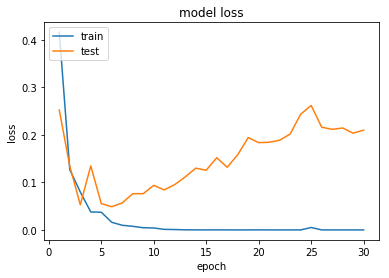

# 과적합(Overfitting)과 과소 적합(Underfitting)

## 목차
- [과적합](#Overfitting)
- [과소 적합](#Underfitting)
- [QA](#QA)

---

### Overfitting
Overfitting(과적합) 이란 훈련 데이터를 과하게 학습한 경우를 말한다.
머신 러닝 모델이 학습에 사용하는 훈련 데이터는 실제로 앞으로 기계가 풀어야 할 현실의 수많은 문제에 비하면 극히 일부에 불가한 데이터다.
기계가 훈련 데이터에 대해서만 과하게 학습하면 성능 측정을 위한 데이터인 테스트 데이터나 실제 서비스에서는 정확도가 좋지 않은 현상이 발생한다.
과적합 상황에서는 훈련 데이터에 대해서는 오차가 낮지만, 테스트 데이터에 대해서는 오차가 커진다.

에포크가 지나치게 크면 훈련 데이터에 과적합이 발생할 수 있다.
동일한 문제지를 반복해서 푸는 경우를 생각하면 된다.

---

### Underfitting
테스트 데이터의 성능이 올라가 여지가 있음에도 훈련을 덜 한 상태를 과소적합(Underfitting)이라 한다. 과소 적합은 훈련 자체가 부족한 상태이므로 훈련 횟수인 에포크가 지나치게 적으면 발생할 수 있다.
훈련 자체를 너무 작게한 생태이므로 훈련데이터에 대해서도 정확도가 낮다는 특징이 있다.

---

### QA
#### Overfitting(과적합)이란 무엇을 의미하나?
1. 훈련 데이터를 충분히 학습하지 않은 경우
2. 훈련 데이터를 과하게 학습한 경우
3. 테스트 데이터를 과하게 학습한 경우
4. 데이터를 전혀 학습하지 않은 경우

정답

2

#### 과적합이 발생할 경우 어떤 현상이 나타나나?
1. 훈련데이터와 테스트 데이터 모두에서 오차가 작아진다.
2. 훈련데이터에서 오차가 크지만 테스트 데이터에서 오차가 작아진다.
3. 훈련데이터에서 오차가 작지만 테스트 데이터에서 오차가 커진다.
4. 훈련데이터와 테스트 데이터 모두에서 오차가 커진다.

정답

3

#### 에포크가 지나치게 크면 어떤 현상이 발생할 수 있나요?
1. 과적합
2. 과소적합
3. 학습 불능
4. 데이터 손실

정답

1

#### 훈련 데이터에 대해 반복적으로 학습하는 상황을 무엇에 비유할 수 있나?
1. 다양한 문제를 푸는 경우
2. 동일한 문제지를 반복해서 푸는 경우
3. 문제를 전혀 풀지 않는 경우
4. 문제를 대출 푸는 경우

정답

2

#### Underfitting(과소적합)이란 무엇을 의미하나?
1. 훈련 데이터를 충분히 학습하지 않은 경우
2. 훈련 데이터를 과하게 학습한 경우
3. 테스트 데이터를 과하게 학습한 경우
4. 데이터를 전혀 학습하지 않은 경우

정답

1

#### 과소적합이 발생할 경우 어떤 현상이 나타나나요?
1. 훈련 데이터와 테스트 데이터 모두에서 정확도가 높아진다.
2. 훈련 데이터에서 정확도가 낮고 테스트 데이터에서 정확도가 높아진다.
3. 훈련 데이터에서 정확도가 높고 테스트 데이터에서 정확도가 낮아진다.
4. 훈련 데이터와 테스트 데이터 모두에서 정확도가 낮아진다.

정답

4

#### 과소적합이 발생할 수 있는 이유는 무엇인가?
1. 훈련 횟수인 에포크가 지나치게 적을 때
2. 훈련 횟수인 에포크가 지나치게 많을 때
3. 데이터의 양이 많을 때
4. 데이터의 질이 높을 때

정답

1

#### 과적합이 발생하는 상황을 피하기 위해서는 어떤 조치가 필요한가?
1. 에포크 수를 무작정 늘인다.
2. 훈련 데이터를 더 많이 사용한다.
3. 훈련 데잍터와 테스트 데이터를 동일하게 사용한다.
4. 에포크 수를 적절히 조절한다.

정답

4

