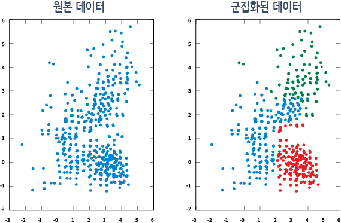

# 지도 학습과 비지도 학습

## 목차
- [군집화](#군집화)
- [군집(cluster)의 타당성 평가](#군집cluster의-타당성-평가)
- [군집화의 분류](#군집화의-분류)
- [군집화의 활용](#군집화의-활용)
- [QA](#QA)

---

### 군집화
비지도 학습에서 사용되는 데이터는 label이 명시되어 있지 않다
이때 많이 사용되는 방법이 데이터가 어떤 형태로 그룹을 형성하는지 파악하는 것이다.
군집화는 레이블이 없는 학습 데이터들의 특징(feature)을 분석하여 서로 동일하거나 유사한 특징을 가진 데이터 끼리 그룹화 함으로써 레이블이 없는 학습 데이터를 군집(cluster, 그룹)으로 분류한다.
그 후 새로운 데이터가 입력되면 학습한 군집을 가지고 어느 군집에 속해있는지 분석하는 것이다.

---

### 군집(cluster)의 타당성 평가
비지도 학습에서 사용되는 데이터에는 레이블이 없으므로, 지도 학습처럼 accuracy를 가지고 그 정확도를 평가할 수는 없다.
레이블이 없는 데이터 집합 내에서 최적의 군집 모양과 개수를 파악하기란 굉장히 어렵다.
군집을 만든 결과가 얼마나 타당한지는 군집간의 거리, 군집의 지름, 군집의 분산도 등을 종합적으로 고려하여 평가할 수 있다.
일단적으로 군집 간 분산이 최대가 되고, 군집 내 분산이 최소가 될 때 최적의 군집 모양과 개수라고 판단하고 있다.

---

### 군집화의 분류
군집화의 주목적은 레이블이 없는 데이터 집합의 요약된 정보를 추출하여, 이를 가지고 전체 데이터 집합이 가지고 있는 특징을 찾는 것이다.

군집화는 크게 두가지 기법으로 나뉜다.
1. 분할 기법의 군집화
2. 계층적 기법의 군집화

분할 기법의 군집화는 각 그룹은 적어도 하나의 데이터를 가지고 있어야 하며 각 데이터는 정확히 하나의 그룹에 속해야 한다는 규칙을 가지고 데이터 집합을 작은 그룹으로 분할 하는 방식이다. k-means, k-mediods, DBSCAN 등의 기법 등이 있다.

계층적 기법의 군집화는 데이터 집합을 계층적으로 분해하는 방식으로 그 방식에 따라 또다시 집괴적(agglomerative) 군집화와 분할적(divisive) 군집화로 나눠진다.

---

### 군집화의 활용
군집화는 특정 질병에 대한 공간 군집 분석을 통해 질병의 분포 면적과 확산 경로 등을 파악하는 역학 조사 등에서 활용되고 있으며, 홍보 분야에서 고객을 세분화 할 때도 쓰인다.
또한, 통계 분야에서도 분석하고자 하는 데이터에 다양한 군집화 알고리즘과 방법론을 사용하여 데이터 분석에 활용해 나가고 있는 추세
---

### QA
#### Q. 비지도 학습에서 사용되는 데이터의 특징은?
1. 레이블이 명시되어 있다.
2. 레이블이 명시되어 있지 않다.
3. 레이블이 선택적으로 사용된다.
4. 레이블이 항상 동일하다.

정답

2

#### Q. 군집화는 새로운 데이터가 입력되었을 때 무엇을 분석하나?
1. 데이터를 예측한다.
2. 데이터를 군집으로 분류한다.
3. 데이터를 학습한다.
4. 데이터를 강화한다.

정답

2

#### Q. 군집화의 결과로 데이터를 어떻게 분류하나?
1. 동일한 데이터를 그룹화한다.
2. 서로 동일하거나 유사한 특징을 가진 데이터끼리 그룹화한다.
3. 임의로 데이터를 그룹화한다.
4. 모든 데이터를 하나의 그룹으로 묶는다.

정답

2

#### Q. 비지도 학습에서 군집의 타당성을 평가할 때, 지도 학습과 같이 사용할 수 없는 지표는 무엇인가?
1. Accuracy
2. 군집과의 거리
3. 군집의 지름
4. 군집의 분산도

정답

1

#### Q. 군집의 타당성을 평가할 때 고려해야 할 요소는 무엇인가?
1. 데이터의 양
2. 데이터의 정확도
3. 군집간의 거리, 군집의 지름, 군집의 분산도
4. 데이터의 라벨링

정답

3

#### Q. 최적의 군집 모양과 개수를 판단하는 기준은 무엇인가?
1. 군집 간 분산이 최소가 되고, 군집 내 분산이 최대가 될 때
2. 군집 간 분산이 최대가 되고, 군집 내 분산이 최소가 될 때
3. 군집 간 거리가 최소가 될 때
4. 군집의 지름이 최대가 될 때

정답

2

#### Q. 군집의 타당성을 평가할 때 군집 간 분산은 어떤 방향으로 되어야 하나?
1. 최소
2. 최대
3. 변화 X
4. 무시해도 된다

정답

2

#### Q. 군집의 타당성을 평가할 때 군집 내 분산은 어떤 방향으로 되어야 하나?
1. 최소
2. 최대
3. 변화 X
4. 무시해도 된다

정답

1

#### Q. 군집화의 주 목적은 무엇인가?
1. 레이블이 있는 데이터 집합의 정보를 요약하기 위해
2. 레이블이 없는 데이터 집합의 요약된 정보를 추출하여 특징을 찾기 위해
3. 데이터의 정확도를 높이기 위해
4. 데이터를 예측하기 위해

정답

2

#### Q. 군집화는 크게 어떤 기법으로 나뉘나?
1. 지도 학습과 비지도 학습
2. 분할 기법과 계층적 기법
3. 회귀 기법과 분류 기법
4. 강화 학습과 비지도 학습

정답

2

#### Q. 분할 기법의 군집화는 어떤 규칙을 가지고 있나?
1. 각 데이터는 여러 그룹에 속할 수 있다.
2. 각 그룹은 적어도 하나의 데이터를 가지고 있어야 하며 각 데이터는 정확히 하나의 그룹에 속해야 한다.
3. 각 그룹은 데이터를 가질 필요가 없다.
4. 각 데이터는 여러 그룹에 속해야 한다.

정답

2

